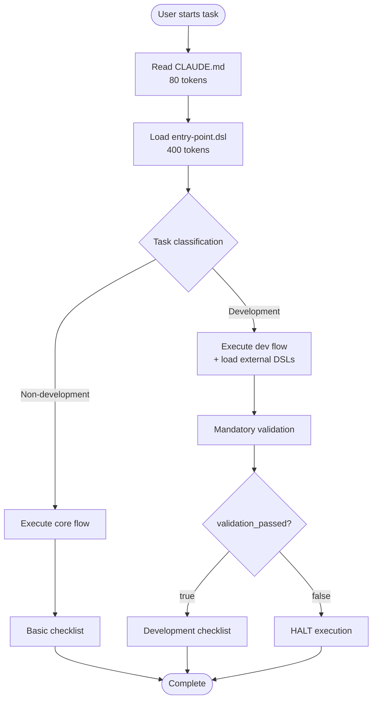
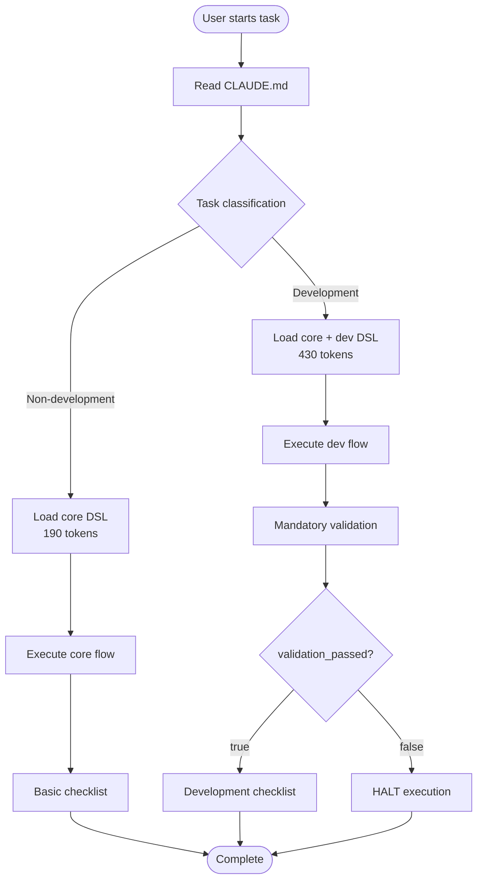
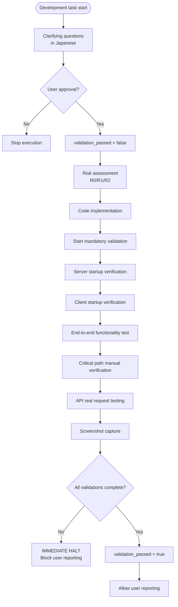
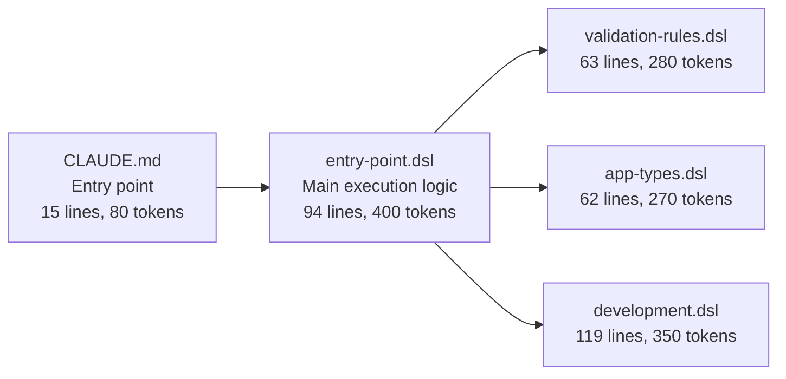
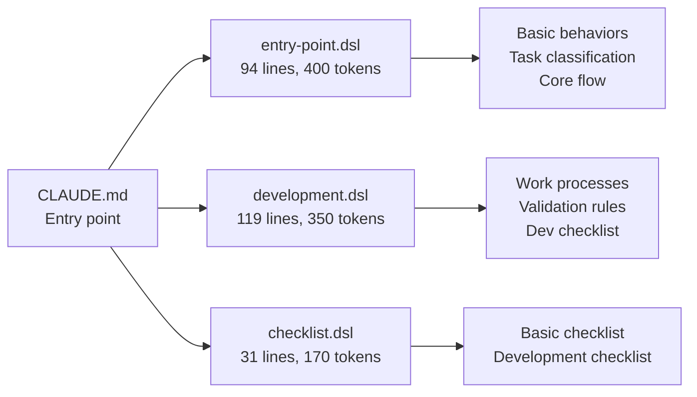
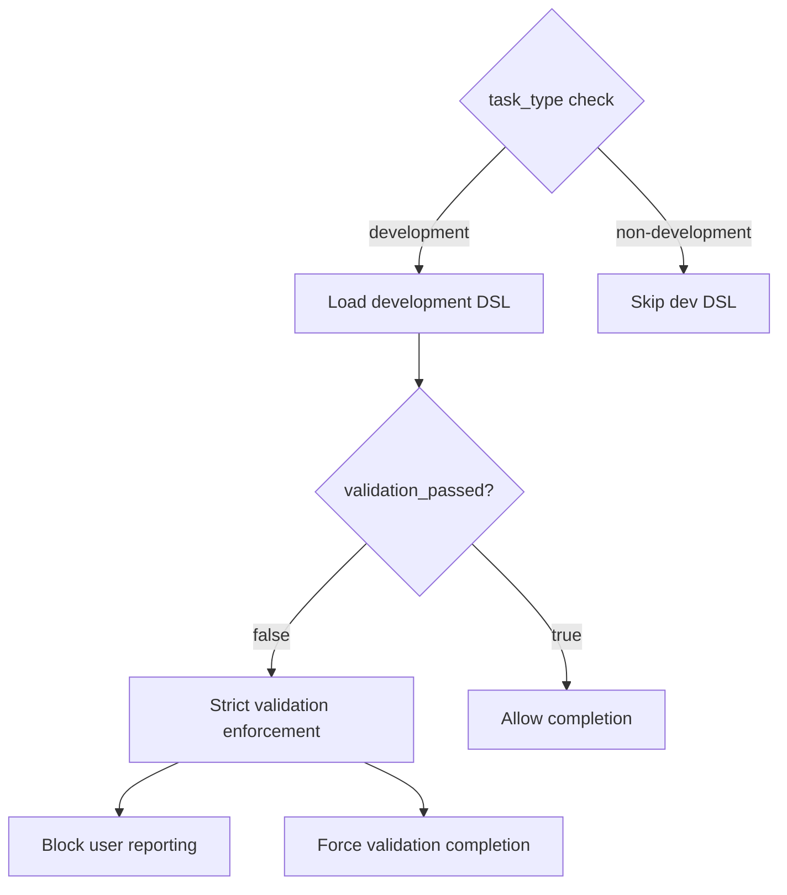
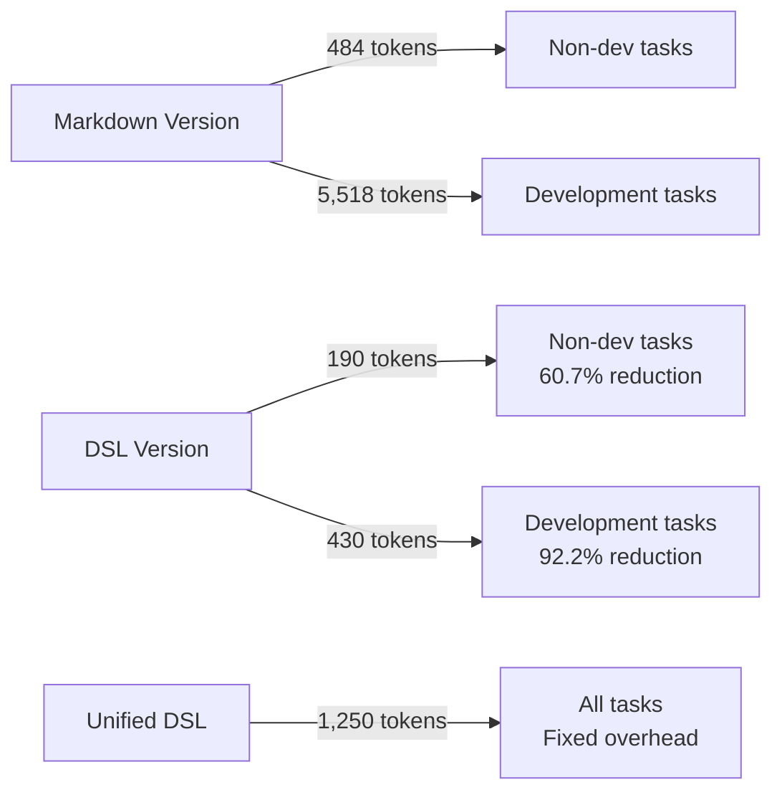
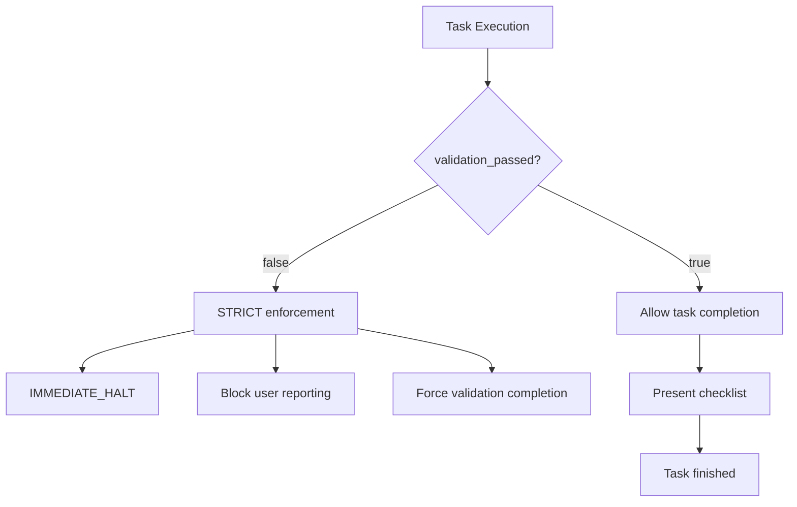

# Claude DSL Processing Flow

## 1. Overall Flow Overview

### Main DSL Flow (Recommended)


### Split DSL Flow (Advanced)


## 2. Development Task Detailed Flow



## 3. DSL File Structure and Loading

### Main DSL Structure (Recommended)


### Split DSL Structure (Advanced)


## 4. Conditional Logic



## 5. Token Efficiency Comparison



## 6. Conditional Loading Logic

```yaml
# Core DSL decides loading strategy
rules:
  - if: task_type == "development"
    then:
      include:
        - components.validation_rules
        - components.work_process  
        - components.validation
  - if: not validation_passed
    then:
      action: halt
      message: "Complete ALL validation requirements"
```

## 7. Enforcement Mechanisms



## Key Benefits of DSL Approach

1. **Conditional Loading**: Only load what's needed per task type
2. **Variable Control**: `validation_passed` enforces completion
3. **Modular Design**: Separate concerns across files
4. **Token Efficiency**: 92.2% reduction for development tasks
5. **Strict Enforcement**: No exceptions to validation rules
6. **Language Requirements**: Built-in Japanese communication rules