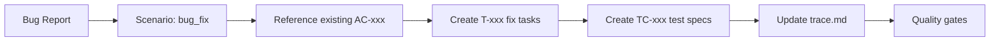
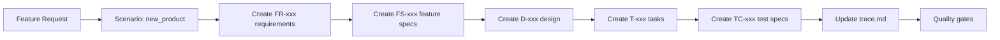

# orik - Scenario-Based Documentation Workflow Framework

**orik** is an enterprise-grade documentation workflow framework that automatically determines which documents to create based on development scenarios, eliminating unnecessary work while maintaining complete traceability.

## 🎯 What Makes orik Different?

Instead of creating all documents for every change, orik intelligently determines documentation needs:

- **Bug fix**: Only create tasks + test specs (reference existing requirements)
- **UI change**: Update feature specs + tasks + test specs (skip full design)  
- **New feature**: Full documentation chain (requirements → design → tasks → test specs)
- **Refactor**: Technical tasks + optional design notes

**Result**: 70% less documentation overhead while maintaining 100% traceability.

## 🚀 Quick Start

### 1. Basic Usage
```bash
# Tell Claude to use orik framework
Follow entry-point.dsl for complete DSL execution
```

### 2. Development Scenarios
Claude automatically classifies your request into one of 7 scenarios:

1. **New Product**: Complete new product/major feature → Full documentation
2. **Major Feature**: Significant functionality addition → Update affected docs  
3. **UI Change**: Interface/copy changes → FS + tasks only
4. **Bug Fix**: Behavior not matching specs → Tasks + test specs only
5. **Spec Change**: Modifying requirements/AC → Cascade updates
6. **Refactor**: Internal optimization → Technical tasks only
7. **Infrastructure**: Performance/infrastructure → NFR + design + tasks

### 3. Automatic Document Planning
```
User: "Fix the login button styling"
Claude: 
- Scenario: UI Change
- Required: Feature Spec (FS) revision + Tasks + Test Specs
- Skip: Requirements, Full Design, ADR
- Proceed? [y/n]
```

## 📁 Framework Architecture

```
orik/
├── entry-point.dsl              # Entry point & task classification  
├── flow.dsl                     # Scenario-based workflow engine (v0.6)
├── checklist.dsl                # Quality gates & validation
└── templates/
    ├── requirements-template.md  # FR/AC with ID traceability
    ├── design-template.md        # D-xxx component specifications
    ├── tasks-template.md         # T-xxx implementation tasks  
    ├── feature-spec-template.md  # FS-xxx UI/UX specifications
    ├── test-spec-template.md     # TC-xxx comprehensive testing
    ├── system-design-policy-template.md  # Enterprise governance
    └── ci/
        └── github-actions-quality-gates.yml  # CI/CD automation
```

## ✨ Key Features

### 🎯 Scenario-Based Intelligence
- **7 development scenarios** with specific document requirements
- **Composite scenario support** (e.g., "UI change + minor design update")
- **Impact assessment** to determine documentation scope

### 📋 Complete Traceability
- **ID-based linking**: FR-001 → FS-001 → D-001 → T-001 → TC-001
- **Automatic trace matrix** generation and validation
- **100% coverage enforcement** with quantified thresholds

### 🔄 Production-Ready Automation
- **CI/CD integration** with GitHub Actions quality gates
- **Automated validation** of document schemas and traceability
- **Performance/accessibility/security** testing templates

### 📊 Enterprise Governance
- **System Design Policy** with organization-wide rules
- **Document lifecycle management** with proper versioning
- **Stakeholder approval workflows** and sign-off tracking

## 🔄 Workflow Example

### Scenario: Bug Fix


### Scenario: New Feature  


## 📝 Document Templates

### Requirements (FR/AC)
- **Functional Requirements** with Given-When-Then acceptance criteria
- **Non-Functional Requirements** (NFR) for performance/security
- **Complete scope definition** (In/Out) with constraints

### Feature Specifications (FS)
- **UI/UX specifications** with concrete layouts and interactions
- **Data models** and API contracts
- **Accessibility requirements** (WCAG 2.1 AA)

### Design (D)
- **Component architecture** with public API definitions
- **Event flow diagrams** and state management
- **Error handling** and cleanup policies

### Tasks (T)
- **Implementation breakdown** with Definition of Done
- **Dependencies** and execution order
- **Scenario classification** for proper workflow

### Test Specifications (TC)
- **Functional/Non-functional/Edge case** testing
- **Performance/Accessibility/Security** test templates
- **Automated test integration** with CI/CD pipelines

## 🎯 Benefits

### For Development Teams
| Traditional Approach | orik Approach |
|---------------------|---------------|
| Create all docs for every change | Smart scenario-based documentation |
| Manual traceability management | Automated ID linking and validation |
| Inconsistent document quality | Standardized templates with quality gates |
| Manual testing specifications | Integrated test spec generation |

### For Enterprise Organizations
- **Compliance ready**: Complete audit trails and traceability
- **Scalable governance**: System Design Policy for organization-wide rules
- **Quality assurance**: Automated validation and CI/CD integration
- **Risk management**: Quantified coverage thresholds and validation

## 🛠 Advanced Usage

### Composite Scenarios
```bash
# Handle complex changes automatically
User: "Update the user profile UI and add better error handling"
Claude: Detected composite scenario [ui_change + design]
- Merging requirements using priority: create > revise > update > reference
- Final plan: FS(revise) + D(revise) + T(create) + TC(revise)
```

### Custom Quality Gates
```yaml
# CI validation with quantified thresholds
- Traceability coverage: 100%
- Document schema validation: Required
- Test coverage with FR/AC tags: 90%+
- Performance budgets: LCP < 2.5s
```

### Automation Hooks
```bash
# Automatic workflow triggers
make new:feature FR=012    # Generate FR→FS→D→T templates
make change:spec FS=003    # Update cascade for spec changes
make trace:validate        # Validate complete traceability
```

## 🚀 Getting Started

1. **Initialize**: Copy orik files to your project
2. **Configure**: Update templates with your project specifics
3. **Run**: Tell Claude to "Follow entry-point.dsl"
4. **Iterate**: Let Claude classify scenarios and create optimal documentation

## 🤝 Contributing

orik is designed for enterprise use and continuous improvement:

- **Template enhancements** for specific industries/domains
- **Quality gate expansions** for additional validation rules  
- **CI/CD integrations** for different platforms
- **Automation hooks** for workflow optimization

## 📄 License

Open source - production ready for enterprise deployment.

---

**orik**: From reactive documentation to proactive workflow intelligence.