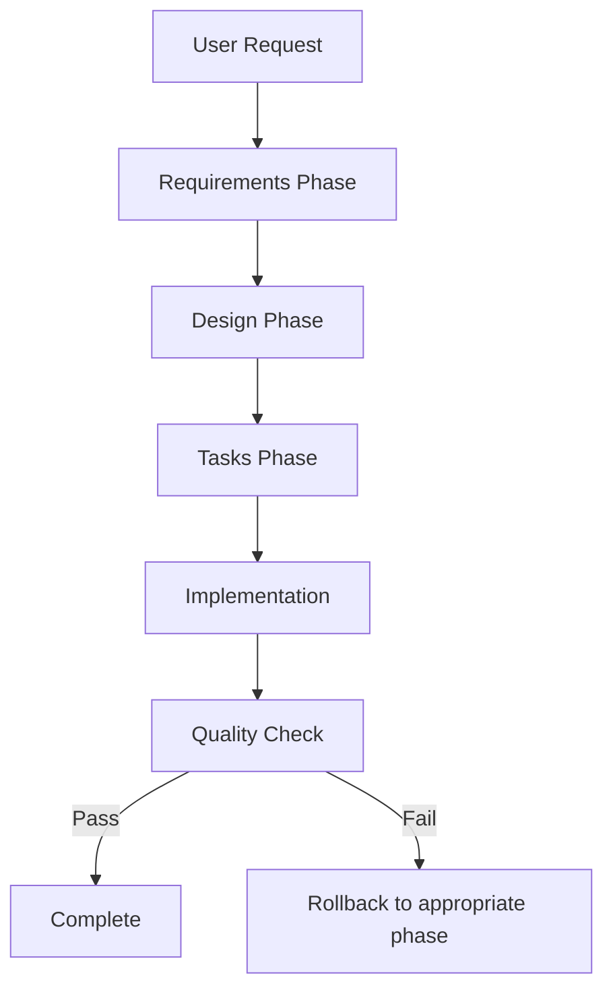

# orik - Spec-Driven Development Framework

**orik** (kiroの反対) is a specification-driven development framework designed for Claude to create and implement software projects systematically.

## 🎯 What is orik?

Unlike traditional "vibe coding", orik follows Amazon's kiro concept of **specification-driven development** with a structured 3-phase approach:

1. **Requirements** (`requirements.md`) - Define what to build
2. **Design** (`design.md`) - Plan how to build it  
3. **Tasks** (`tasks.md`) - Break down implementation steps

The key difference: **Claude creates the specifications and Claude implements them**, ensuring complete alignment between planning and execution.

## 🚀 Quick Start

### Method 1: Use spec-driven.dsl (Recommended)

```bash
# Tell Claude at session start:
Follow spec-driven.dsl for systematic development
```

### Method 2: Manual Process

1. **Requirements Phase**: Create detailed `requirements.md`
2. **Design Phase**: Create comprehensive `design.md`
3. **Implementation Phase**: Create actionable `tasks.md`
4. **Development**: Execute tasks systematically

## 📁 Framework Structure

```
orik/
├── spec-driven.dsl      # Main framework (NEW)
├── entry-point.dsl      # Task classification & flow control
├── validation-rules.dsl # 4-level validation framework
├── app-types.dsl        # Application type definitions
├── security-rules.dsl   # Security requirements by priority
└── development.dsl      # Original development-specific rules
```

## ✨ Key Features

### For Claude
- **Self-documenting**: Claude creates specs Claude can implement
- **Structured templates**: Consistent document formats
- **Quality gates**: Built-in validation at each phase
- **Error recovery**: Clear rollback mechanisms

### For Developers
- **Systematic approach**: No more "vibe coding"
- **Complete documentation**: Every project fully documented
- **Predictable outcomes**: Clear success criteria
- **Reusable framework**: Works for any project type

## 🔄 Development Flow



## 🎯 Why orik?

| Traditional Approach | orik Approach |
|---------------------|---------------|
| "Build me a TODO app" → Random implementation | Structured requirements → Design → Tasks → Implementation |
| Unclear scope and requirements | Explicit requirements with success criteria |
| Implementation surprises | Predictable, documented development |
| Hard to modify or extend | Clear architecture for modifications |

## 🛠 Usage Examples

### Simple Project
```
User: "Create a simple calculator app"
Claude: [Creates requirements.md → design.md → tasks.md → implements systematically]
```

### Complex Project  
```
User: "Build a social media dashboard with real-time updates"
Claude: [Detailed requirements → Architecture design → Implementation plan → Step-by-step development]
```

## 🤝 Contributing

orik is designed to be extended and improved. The DSL framework allows for:
- Custom application types
- Additional validation rules
- Enhanced quality gates
- Specialized templates

## 📄 License

Open source - feel free to fork, modify, and improve!